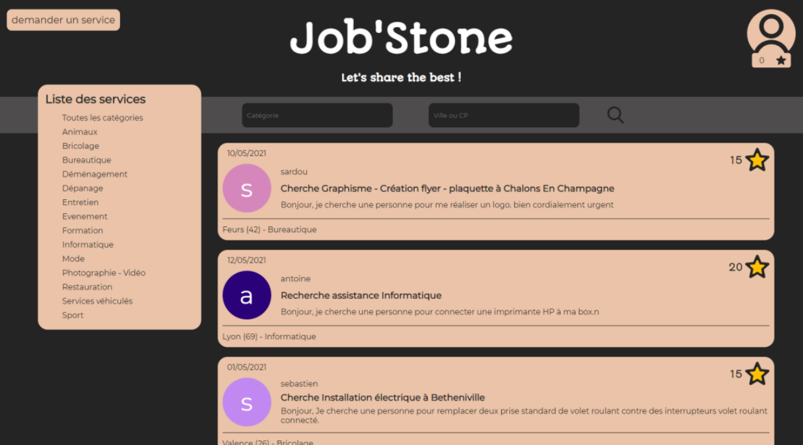
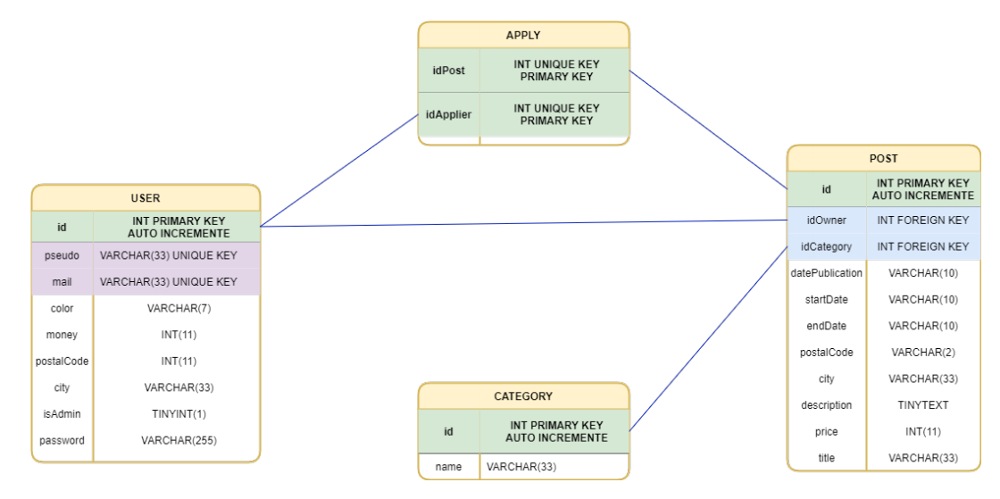

# JobStone
## Qu'est-ce que JobStone ?
Job’Stone est un site web d’entraide entre particuliers inspiré du célèbre site "Allo Voisin".

Comme ce dernier, le site web nouvellement créé permet à des utilisateurs de poster des annonces ou de candidater à celles-ci dans un esprit d’entraide collectif, basé sur une idéologiesimple : offrir de son temps.

## Architecture
Le projet est constitué de cinq dossiers principaux :
— le dossier "pages" : La partie HTML.
— le dossier "styles" : La partie CSS.
— le dossier "scripts" : La partie JS.
— le dossier "php" : La partie PHP..
— le dossier "res" : Les ressources (icones).

## Base de données
La base de données est organisé en quatre tables, USER, POST, CATEGORY et APPLY.

## Déploiement du site ?
Le site n'est malheureusement pas déployé, les accès à la base de données sont donc impossibles actuellement. L'utilisation du site en est forcément restreinte.